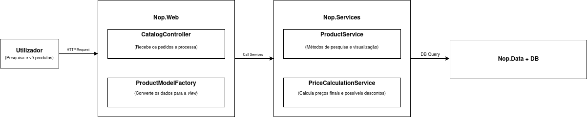

# NopCommerce - Observability

## Introdução

Este projeto consiste na instrumentação do **nopCommerce** com **OpenTelemetry**, centrando o nosso foco no fluxo **"Customer searches and views a product"**. Para tal, foram adicionados tracing, métricas personalizadas e logs estruturados.

## Estrutura do projeto

```bash
AS_INDIVIDUALPROJECT_NOPCOMMERCE/
├── docker-compose.yml
├── otel-config.yaml                   # Configuração do OpenTelemetry Collector
├── prometheus.yml                     # Configuração do Prometheus
├── load-test.js
├── load-test-advanced.js
│
├── src/
│   ├── Nop.Core/
│   │   └── Observability/
│   │       └── TelemetryMetrics.cs    # Métricas customizadas
│   │
│   ├── Nop.Services/
│   │   └── Catalog/
│   │       ├── ProductService.cs          # Instrumentado com spans e métricas
│   │       └── PriceCalculationService.cs # Instrumentado com spans e métricas
│   │
│   └── Nop.Web/
│       ├── Controllers/
│       │   └── CatalogController.cs       # Instrumentado com spans
│       ├── Factories/
│       │   └── ProductModelFactory.cs     # Instrumentado com spans
│       └── Program.cs                     # Configuração OpenTelemetry
```


## Fluxo escolhido e respetiva arquitetura

O fluxo escolhido prende-se com 3 etapas centrais da utilização da NopCommerce **(*Catalogue* - *Search* - *Princing*)**:
- Pesquisa de produtos
- Visualização de detalhes do produto
- Cálculo de preços e aplicação de descontos

### Componentes instrumentadas

| Componente | Spans | Métricas | Tags Principais |
|------------|-------|----------|-----------------|
| `CatalogController` | `CatalogController.Category`<br>`CatalogController.Search`<br>`CatalogController.AutoComplete` | - | `category.id`, `category.name`, `category.products_count`, `category.duration_ms`<br>`search.term`, `search.category_id`, `search.results_count`, `search.page_results`, `search.duration_ms`<br>`http.method`, `http.target`, `http.status_code`, `http.user_agent` |
| `ProductModelFactory` | `ProductModelFactory.PrepareProductDetails` | - | `product.id`, `product.name`, `is_associated_product`, `duration_ms` |
| `ProductService` | `Catalogue.GetProductById`<br>`Catalogue.SearchProducts`<br>`Catalogue.KeywordSearch`<br>`Catalogue.DBQuery`<br>`Catalogue.FormatStockMessage` | `SearchDurationMs`<br>`SearchResultsCount`<br>`ProductDetailsLoadDurationMs` | `catalog.product_id`, `catalog.product_found`, `catalog.cache_hit`, `catalog.db_duration_ms`<br>`catalog.page_index`, `catalog.page_size`, `catalog.category_filter`, `catalog.manufacturer_filter`, `catalog.has_keywords`, `catalog.price_min`, `catalog.price_max`, `catalog.store_id`, `catalog.vendor_id`, `catalog.product_type`, `catalog.result_count`, `catalog.duration_ms`<br>`catalog.keyword`<br>`catalog.manage_inventory`, `catalog.stock_message_length` |
| `PriceCalculationService` | `PriceCalculation.GetDiscountAmount`<br>`PriceCalculation.GetFinalPrice` | `ProductPriceCalculationDurationMs` | `product.id`, `price_before_discount`, `discount_calculation.duration_ms`<br>`product.name`, `product.base_price`, `customer.id`, `store.id`, `quantity`, `include_discounts`, `product.is_rental`, `price.overridden`, `price.tier_applied`, `price.tier_quantity`, `price.additional_charge`, `price.rental_periods`, `discount.applied`, `discount.amount`, `discount.count`, `price.final`, `price.original`, `price.discount_amount`, `calculation.duration_ms` |
|

### Diagrama da arquitetura do fluxo implementado

De seguida apresentamos o diagrama da arquitetura relativa ao fluxo escolhido e implementado do ponto de vista da observabilidade.




## Build e Run do NopCommerce:

### Etapas

1- Dar clone do repositório:
- ```git clone ...```
- ```cd AS_IndividualProject_nopCommerce```

2- Iniciar todos os serviços e dar build:
- ```docker compose up -d --build```

3- No final desta segunda etapa podemos confirmar se todos os containers estão *Up*:
- ```docker compose ps -a```

4- Após conferir que tudo se encontra *Up*, podemos abrir a UI do NopCommerce - ```http://localhost:80```.

- À partida, a UI vai abrir na sua página de instalação ```/install```. Caso aconteça seguem as informação, principalmente relativas à BD, a colocar nos campos respetivos:
    - A primeira parte do formulário de instalação corresponde às credencias de acesso à pagina de adminstrador ```/admin```.
    - A segunda parte já se direciona com a Base de Dados. Antes de preenchermos qualquer tipo de informação, e considerando que não temos Base de Dados configurada muito menos com dados, não esquecer de selecionar a opção, na respetiva check box, que remete para a respetiva população da BD com dados default.
    Após isso, podemos preecher os campos referentes à BD:
        - **Nome do servidor**: ```nopcommerce_mssql_server```
        - **nome do banco de dados**: ```nopcommerce_db```
        - **user**: ```sa```
        - **pass**: ```nopCommerce_db_password```

- Nota: após a submissão e a conclusão da respetiva instalação, temos acesso à UI. É aconselhado que se façam pesquisas por equipamentos, entre outras operações que se enquadrem com o fluxo escolhido onde foi aplicado observabilidade para depois, sim, avaliar essas mesmas operações.

- **Load Tests**:

    | Script | Descrição |
    |--------|-----------|
    |  `load-test.js` | Carga constante |
    | `load-test-advanced.js` | Carga variável com stages e thresholds |


5- Posto isto, para aceder aos serviços como o **Grafana, Jaeger, Prometheus** seguem os URL respetivos:
- Grafana: ```http://localhost:3000```
- Jaeger: ```http://localhost:16686```
- Prometheus: ```http://localhost:9090```


## Critique.md
Em jeito de conclusão, é importante referir que o ficheiro ```Critique.md``` contém uma análise arquitetural e das decisões da instrumentação tomadas.
